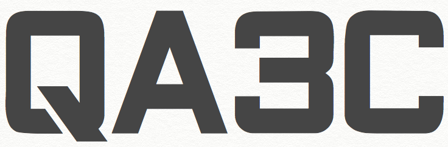

# Quality Assurance in the Context of Cloud Computing 2018

***[A Utility and Cloud Computing (UCC) Workshop](http://ucc-conference.org)***

One of the key properties of cloud technologies is their promise for scalability, resilience, along with the ability to use many services provided and managed by cloud providers. During the last years the release of a mature set of technologies enabled the possibility to experiment new concepts and scenarios, however there is still a lack of consolidated methods tackling quality assurance of Cloud solutions by systematically influencing the analysis, the design, and the validation of Cloud-based Platforms and Services. In fact, being able to scale on-demand, or to monitor the status of a virtual resource do not contribute per-se to the quality of a solution.  On one side, Cloud-based Platforms and Services might need to be conceived in order to properly ensure desired sets of quality attributes. On the other side, quality enablers tools (e.g. code generators, policy enforcement modules, verification frameworks, testing tools, monitoring and reporting suites) need to be brought to the cloud, and they also need to be aware of the cloud in order to assess target quality aspects.

**Key Dates:**

* Submission Deadline: 3rd September 2018 (03.09.2018)
* Notification to Authors: September 17th 2018 (17.09.2018)
* Camera Ready Paper: October 8th 2018 (08.10.2018)
* Workshop: TBD - UCC runs from 17th to the 20th of December (17-20.12.2018)

## Objectives

The UCC QA3C workshop aims to bring together researchers from both Academia and Industry with the aim of sharing ideas, perspective and approaches supporting the engineering of a new generation Cloud-based Platforms and Services. Proceedings will be published by the [IEEE](http://www.ieee.org) in the same volume as [UCC18](http://ucc-conference.org).

## Topics of Interest

Given the objectives of QA3C, the topics of interest of the QA3C workshop include, but are not limited to:

* DSLs for functional and extra-functional properties on the Cloud
* Sustainability analysis of Cloud-based Platform and Services
* Formal methods for specifying and analyzing solutions in context of Cloud Computing
* Integration of design-time and run-time QA techniques
* Autonomic techniques for QA in the context of Cloud-based Platform and Services
* Cloud-based Testing (i.e. in the cloud, for the cloud, of the cloud)
* Configuration management in testingPerformance testing of scalable applications
* Security testing in cloud-native applicationsFunctional testing of cloud-native applications
* Test architectures for cloud-based testingChaos engineering in testing
* Test orchestration for complex testing suitesTest support services
* Multi-layered analysis techniques for cloud infrastructures
* IT Operations and Governance supporting infrastructure in Cloud Computing
* Trustworthiness in Cloud Platform and Services at run time

Supported by [ElasTest](http://www.elastest.io).

## Target Audience

The targeted audience includes researchers, professionals and practitioners working on approaches enabling quality assurance of cloud-based platform and services. Specifically the list of profiles targeted by the workshop includes but is not limited to: researchers in software engineering, cloud analysts, software architect, IT operations engineers, software developers, and testers.

## Submission

If you want to submit your paper to QA3C then please do so using EasyChair.  All workshop papers are a **maximum** of 6 pages in length (in IEEE format). Additional pages may be purchased (in some circumstances) subject to approval by the proceedings chair.

Successful submissions will be published by the [IEEE](http://www.ieee.org) in the same volume as [UCC18](http://ucc-conference.org).

At least one author of each accepted submission must attend the workshop and that all workshop participants must pay the UCC 2018 workshop day registration fee or the conference fee.

## Organisation

All papers will be reviewed by the Technical Program Committee with a minimum of 3 reviews per paper. 

**Co-chairs:**

* Guglielmo De Angelis, Italian National Research Council (Consiglio Nazionale delle Ricerche, CNR)
* Andy Edmonds, Zürich University of Applied Sciences

**Technical Programme Committee:**

* Francisco Gortazar, Universidad Rey Juan Carlos
* Antonia Bertolino, Italian National Research Council (Consiglio Nazionale delle Ricerche, CNR)
* Micael Gallego, Universidad Rey Juan Carlos
* Malena Donato, ATOS
* Piyush Harsh, Zürich University of Applied Sciences
* Enric Pages, ATOS
* Varun Gowtham, Technical University Berlin
* Andrea Polini, University of Camerino
* Antonino Sabetta, SAP
* Franco Raimondi, Middlesex University London